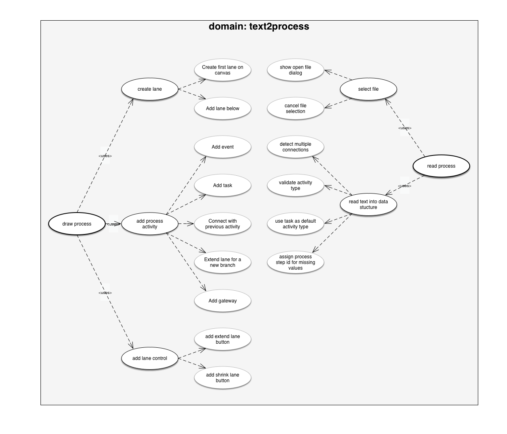

# featuremap

The featuremap script turns BDD feature files into an usecase map using Applescript and OmniGraffle Pro 6.

## prerequisites

* [OmniGraffle 6 Pro](OmniGraffle 6 Pro)
* Applescript
* BDD style feature files (just text, one feature per file, like for [Cucumber](https://github.com/cucumber/cucumber/wiki/Feature-Introduction))

## usage
Run the script from the Applescript Script-Editor. It will ask you for the folder conatining your *.feature files. That's it. The script will read the feature files and genereate a visual map for them in OmniGraffle.

As a result your map could look like this:

